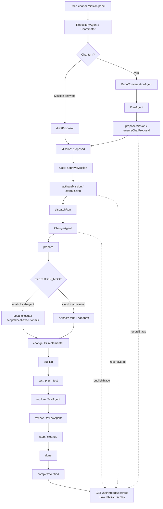

# Pitcrew technical specification

## Mission lifecycle

```text
Feature request
  -> clarifying
  -> proposed
  -> approved
  -> running
  -> awaiting_review
  -> completed | failed | stopped
```

The coordinator stores the mission. A user message, model tool, or attachment cannot approve it or skip a state. `delegate_change` on the production conversation path calls `delegateApprovedMission`. That queues an implementer only when the mission is approved for the current proposal revision, base SHA, and configuration revision.

Editing a proposal creates a new revision and removes the approval. Questions and proposal generation do not reserve an implementation run. Only one queued or running implementation is allowed per project.

## Approval contract

The approved proposal contains:

- summary
- affected area
- acceptance criteria
- command checks

`pinContract()` hashes the project, mission, base SHA, configuration revision, proposal revision, checks, and criteria. The digest excludes the future candidate SHA. The coordinator stores that snapshot. `pinPlan()` remains the acceptance authority for verification evidence.

Before the implementer is prompted, the change pipeline writes the snapshot to `.agent_context/ASSERTIONS.json` in the isolated fork. Publish and verification read it back. A missing file or a different digest rejects the candidate.

## Runtime

| Piece                   | Role                                            |
| ----------------------- | ----------------------------------------------- |
| `RepositoryAgent`       | Coordinator, missions, trace, admission, and API |
| `RepoConversationAgent` | Questions and handoff to the planner             |
| `PlanAgent`             | The only drafter of the proposal                 |
| `ChangeAgent`           | Implementer, contract snapshot, and pipeline     |
| `TestAgent`             | Exploratory probes in a disposable checkout      |
| `ReviewAgent`           | Independent review of code and both test results |
| `UserCredentials`       | Per-user encrypted OpenRouter key                |
| Artifacts               | Fork, candidate ref, and baseline repository     |
| React Work GUI          | Request, answers, approval, evidence, and Flow   |

### Agent orchestration

Happy path from request through verified completion. Flow stages are coordinator-owned
traces (`request` → `plan` → `assign` → `prepare` → `change` → `publish` → `test` →
`explore` → `review` → `stop` → `done`). Inline `pnpm test` is the `test` stage; exploratory
probes go through `TestAgent`.



The Flow tab reads `GET /api/threads/:threadId/trace`. Trace nodes and edges are coordinator-owned, idempotent, and safe to replay. They contain status, revisions, candidate SHAs, and sanitized probe output. They do not contain prompts, credentials, or model reasoning. Deterministic command results stay authoritative. A test-agent probe blocks approval only when the same failure reproduces; suggestions do not override a passing check. Probes never commit to the candidate.

The backend stays at `EXECUTION_MODE=disabled` until a digest-pinned sandbox image, baseline SHA, protected ingress, and an explicit execution approval exist. Workers logs and traces must not include prompts, credentials, repository tokens, or provider secrets.

`PiHarness` is beta. Its lifecycle can resume a Durable Object after eviction. Pitcrew must not install a second harness.

Inline pipeline checks are the first validation path. A later `cf.artifacts.repo.pushed` Workflow is a separate validator for the published candidate ref.

## Baseline

`fixtures/baseline` is a small Node project with a fast test and one documented feature task. `scripts/provision-baseline.mjs` records a local fixture digest. It creates or seeds `pitcrew-baseline` only when cloud provisioning is explicitly approved, revokes the creation credential, and returns the base SHA without logging a token.

## Follow-on sequence

1. Authorized repository selection.
2. Idempotent push Workflow, then preview and browser evidence.
3. Budget-bounded rework that creates a new iteration.
4. Live mission events in the GUI.
5. Trusted compare-and-swap landing.
6. Multiplayer permissions and parallel missions.
